# STM32_RCCAR_CONTROLLER


## 프로젝트 개요
본 프로젝트는 대한상공회의소 서울기술교육센터 AI 융합 로봇 SW 개발자 2기 과정 중 CORTEX-M4 기반 임베디드 시스템 제어 수업의 최종 프로젝트로 진행되었습니다. 

STM32F411xE MCU가 탑재된 Nucleo-64 보드를 기반으로 하며, 모터 제어를 핵심 과제로 삼아 구현되었습니다. 수업 시간에 학습한 모든 하드웨어 자원을 통합적으로 응용하기 위해 'RC카 및 레이싱 제어 시스템'을 최종 주제로 선정하였습니다. 

## 주요 기능

본 프로젝트의 시스템은 크게 컨트롤러, RC카, 스타터, 피니셔 등 4개의 모듈로 구성되어 유기적으로 동작합니다. 각 모듈의 핵심 기능은 다음과 같습니다.

### 1. 컨트롤러 (Controller)
전원이 인가되면 블루투스 모듈을 통해 자동으로 통신 대상을 탐색합니다. 사전에 AT 모드로 설정해둔 RC카의 고유 주소를 기반으로 페어링을 지속적으로 시도하며, 연결이 완료되면 'RC CONTROLLER' 모드로 자동 전환됩니다. 이 모드에서는 아두이노 조이스틱을 활용하여 차량을 제어할 수 있습니다. 전방 및 후방 주행뿐만 아니라 대각선 주행, 그리고 제자리 좌회전 및 우회전 등 전 방향 제어를 지원합니다.

### 2. RC카 (RC Car)
컨트롤러로부터 수신한 방향 및 속도 명령 데이터를 해석하여 모터 드라이버의 제어 신호로 변환합니다. 양측 모터의 속도를 독립적으로 제어하기 위해 PWM(펄스 폭 변조) 기법을 적용하였습니다. 이를 통해 좌우 모터의 듀티비(Duty Cycle)를 다르게 인가하여 부드러운 대각선 주행과 정밀한 방향 전환을 구현했습니다.

### 3. 스타터 (Starter)
레이스의 공정한 출발을 통제하는 모듈입니다. 조도 센서를 활용하여 출발선 위에 두 대의 차량이 모두 대기 상태인지 확인합니다. 두 차량의 준비가 확인된 상태에서 물리 버튼에서 손을 떼면 레이스가 시작되며, 부저와 도트 매트릭스를 통해 카운트다운을 시각적 및 청각적 신호로 제공합니다. 만약 카운트다운 불빛이 완전히 꺼지기 전에 차량이 출발선을 이탈하면 부정 출발로 간주하고, 어느 선수가 먼저 부정 출발을 했는지 도트 매트릭스에 즉각 표시하는 기능을 갖추고 있습니다.

### 4. 피니셔 (Finisher)
결승선 통과를 감지하고 승패를 판정하는 모듈입니다. 양쪽 레인에 설치된 초음파 센서를 통해 진입하는 차량을 실시간으로 스캔합니다. P1(플레이어 1)과 P2(플레이어 2) 중 어느 차량이 먼저 결승선을 통과했는지 밀리초 단위로 감지하며, 최종 승자의 결과를 도트 매트릭스에 명확하게 표기하여 레이스를 마무리합니다.

## 시연 모습

### 전체 시스템 및 완성 모습
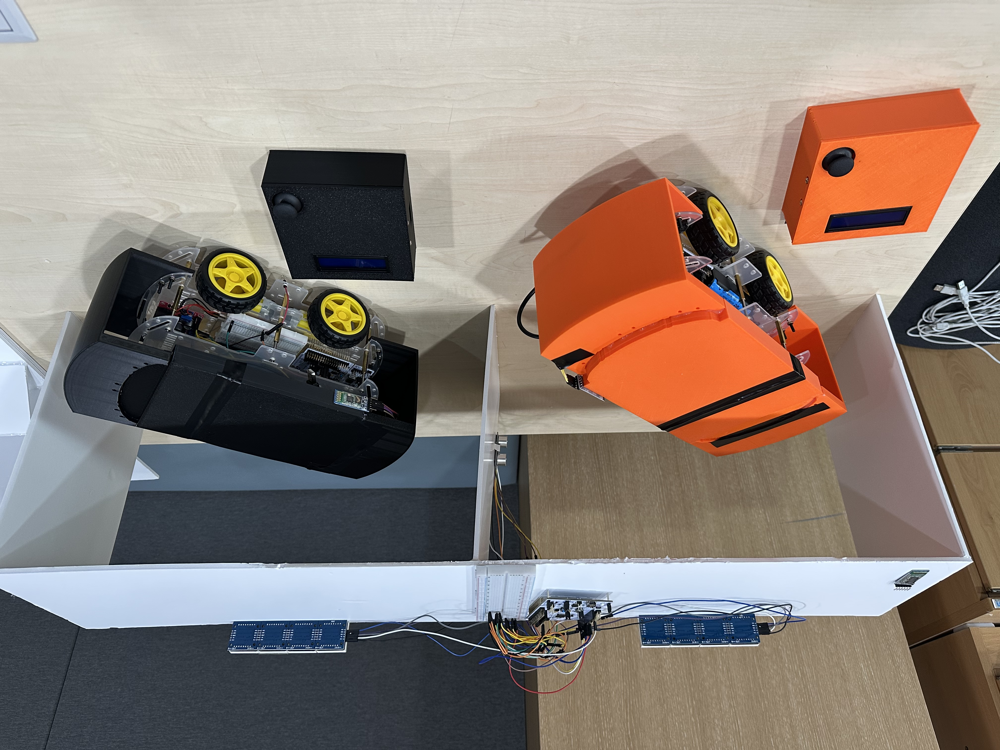
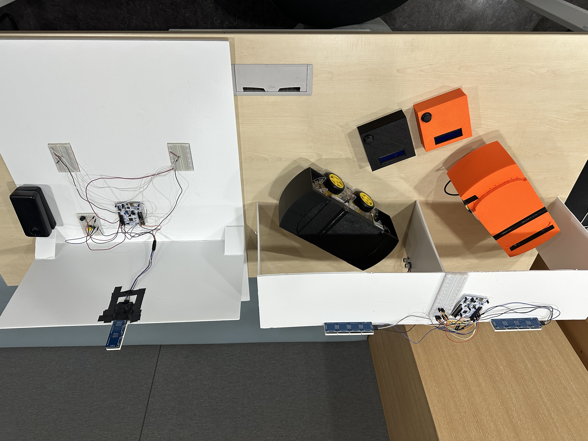

### 레이싱 주행 시연
<video src="./assets/videos/racing.mp4" controls="controls" width="100%"></video>

### 컨트롤러
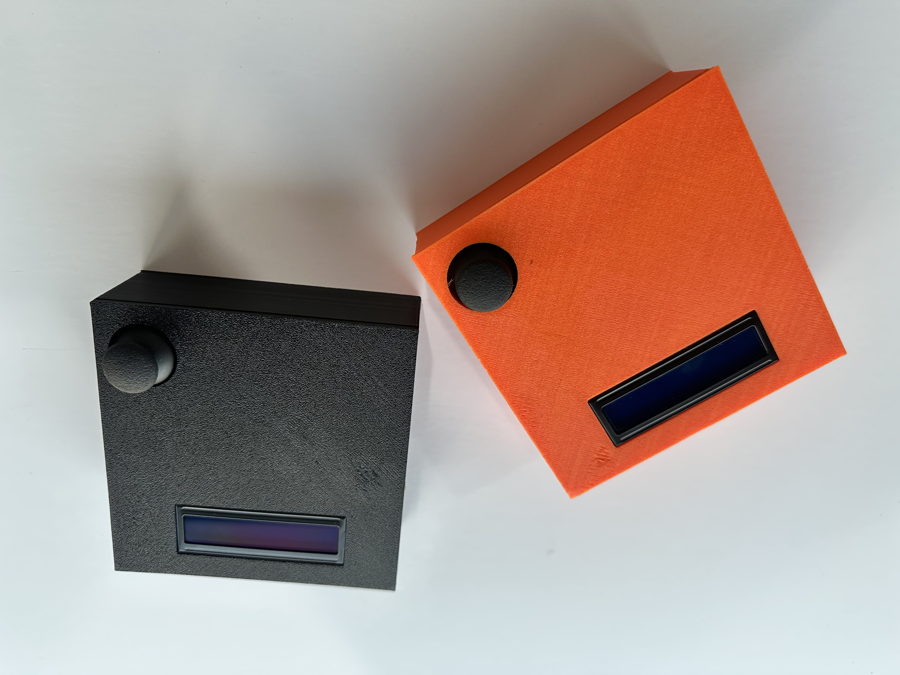
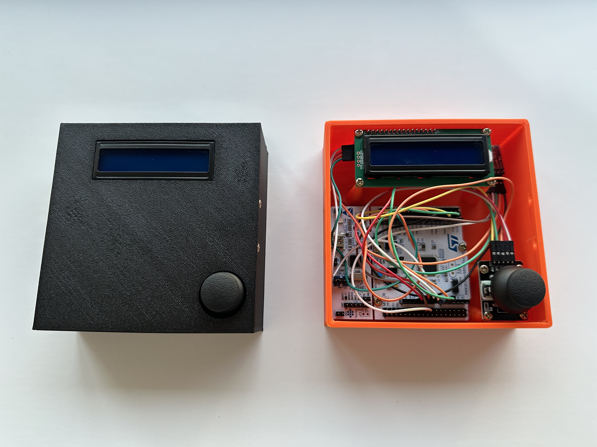
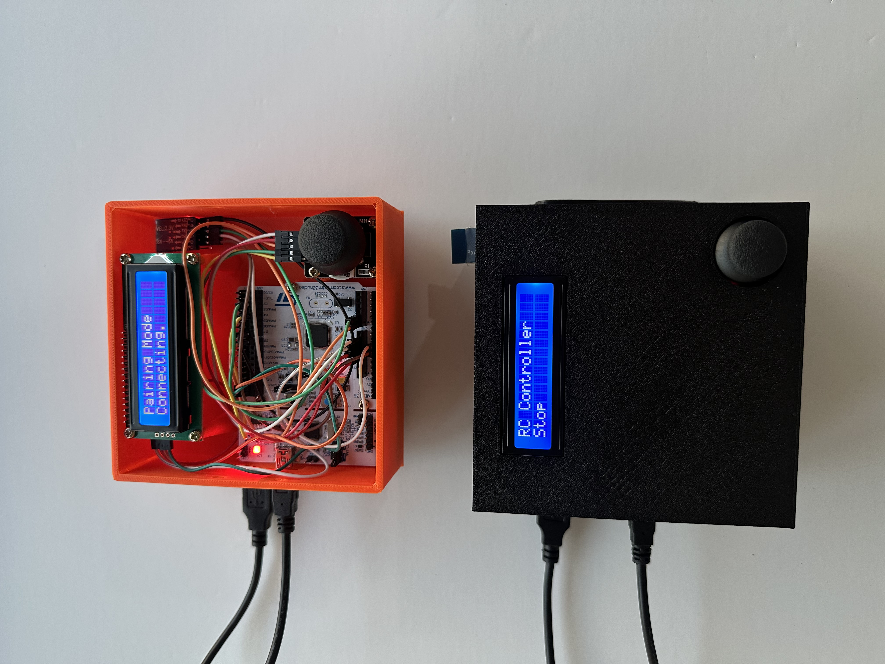

### RC카
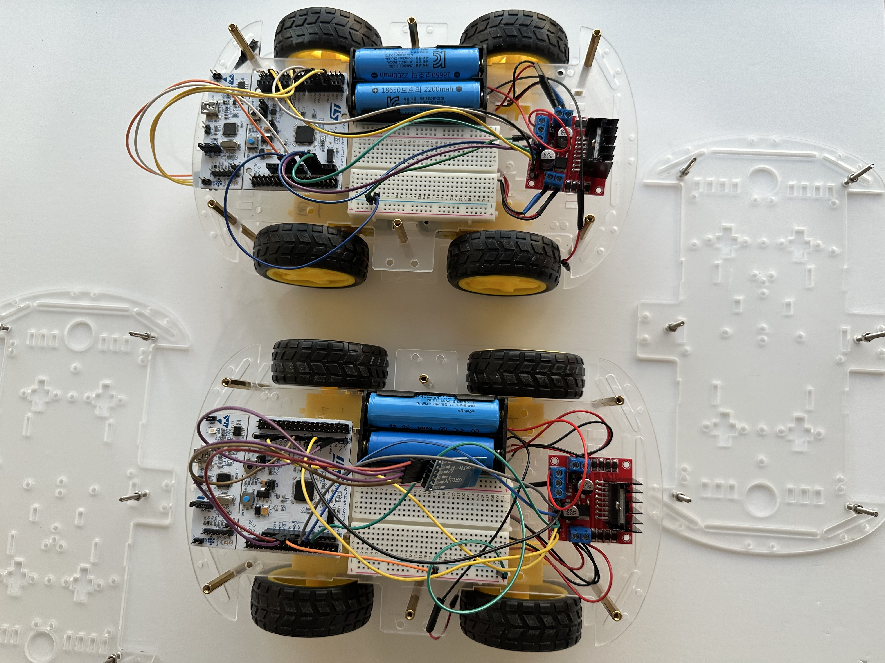
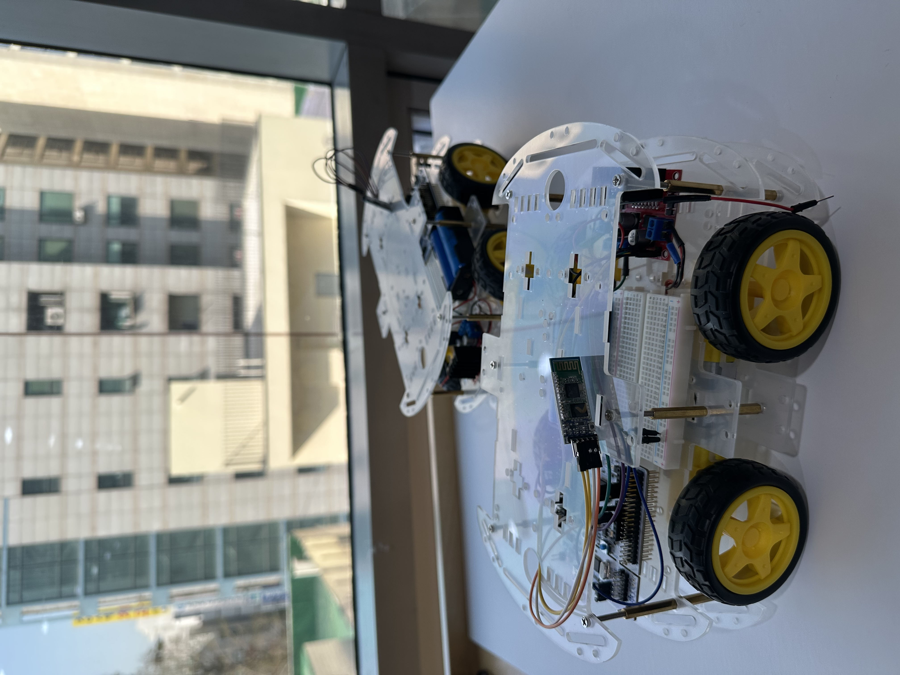
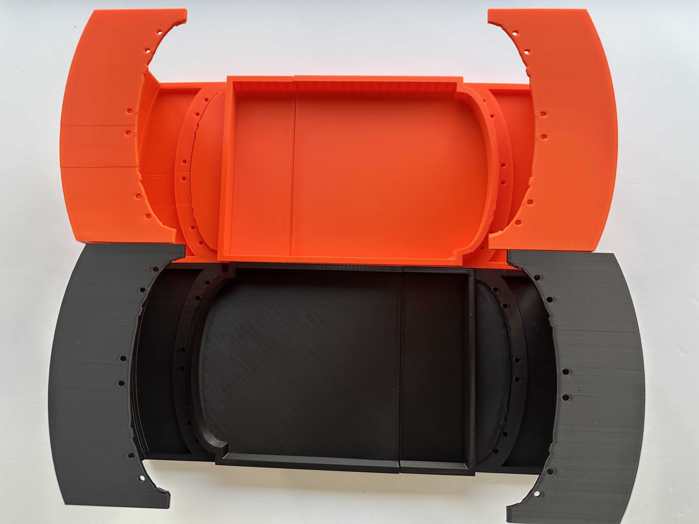
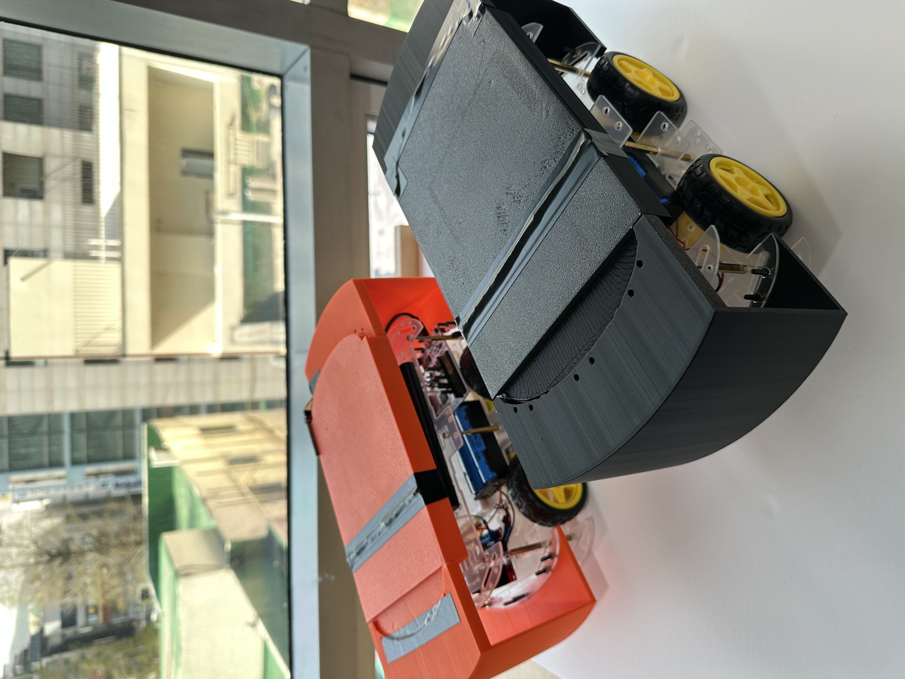

### 스타터
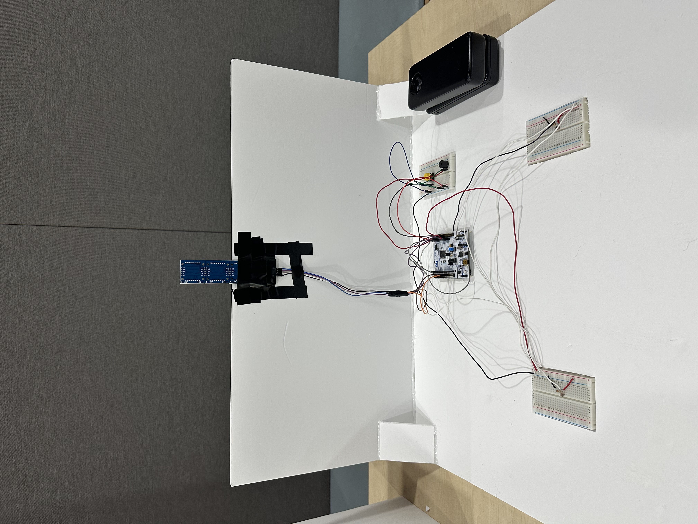

### 부정 출발 감지


### 피니셔
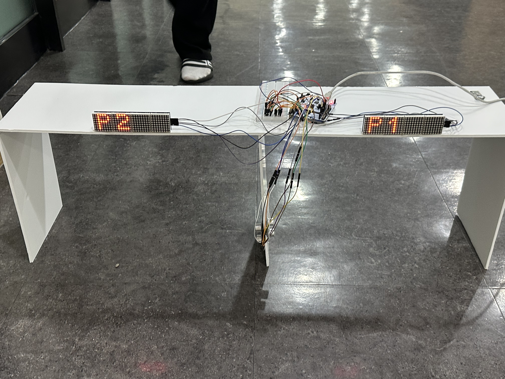

## 개발 환경 및 기술

하드웨어 (Hardware)
- MCU : STMicroelectronics NUCLEO-F411RE (STM32F411xE, ARM Cortex-M4)
- 통신 모듈 : HC-05 블루투스 모듈
- 센서류 : 조도 센서, 초음파 센서, 아날로그 조이스틱 모듈
- 디스플레이 : 1602 LCD (I2C), MAX7219 8*32 도트 매트릭스
- 액추에이터 및 기타 : DC 모터, 모터 드라이버, 부저

소프트웨어 및 개발 환경 (Software & Environment)
- 사용 언어 : C
- 개발 환경 : Visual Studio Code, Arm-GNU Cross Compiler
- 펌웨어 구조 : CMSIS 기반 레지스터 직접 제어 방식 구현

주요 통신 및 제어 기술 (Key Technologies)
- UART : 컨트롤러와 RC카에 각각 장착된 블루투스 모듈 간의 명령 송수신 및 인터럽트 처리
- I2C : 컨트롤러의 1602 LCD 화면에 통신 상태 및 조작 정보 출력
- SPI : 스타터와 피니셔 모듈에서 MAX7219 도트 매트릭스를 제어하여 카운트다운 및 경기 결과 시각화
- PWM : 펄스 폭 변조를 통한 좌우 모터 드라이버의 독립적인 듀티비 제어 및 대각선 주행 구현
- ADC : 조이스틱의 X/Y축 기울기 아날로그 값 및 조도 센서의 빛 노출량 데이터를 디지털로 변환

## 빌드 및 실행 방법
본 프로젝트는 Make 툴체인을 사용하여 터미널 환경에서 간편하게 빌드 및 플래싱을 수행할 수 있습니다. 

1. 하드웨어 연결
펌웨어를 업로드할 타겟 보드를 USB 케이블을 통해 호스트에 연결합니다.
    ```bash
    cd controller/
    ```
    ```bash
    cd rccar/
    ```
    ```bash
    cd starter/
    ```
    ```bash
    cd finisher/
    ```

2. 펌웨어 빌드
터미널을 열고 플래싱하고자 하는 모듈의 디렉토리로 이동합니다. 
    ```bash
    make 
    ```

3. 펌웨어 업로드
호스트에서 컴파일한 결과물을 타겟 보드로 플래싱합니다.
    ```bash
    make flash
    ```

4. 프로젝트 클린업
    ```bash
    make clean
    ```

## 프로젝트 디렉토리 구조
```
STM32_RCCAR_CONTROLLER/
│
├─ assets/                 # 리드미 및 문서화를 위한 이미지 및 GIF 파일
│  ├─ gifs/                # 시연 및 동작 결과 GIF
│  └─ imgs/                # 하드웨어 회로, 보드 조립, 팀원 사진 등
│
├─ controller/             # 컨트롤러 모듈 소스 코드
│  ├─ main.c               # 조이스틱 입력 처리 및 블루투스 송신 메인 로직
│  ├─ joystick.c           # 아두이노 조이스틱 제어
│  ├─ adc.c                # 조이스틱 데이터 해석용 ADC 드라이버
│  ├─ i2c.c                # 1602 LCD 제어를 위한 I2C 통신 드라이버
│  ├─ lcd.c                # 1602 LCD 디스플레이 제어 드라이버
│  ├─ uart.c               # HC-05 블루투스 모듈 통신 드라이버
│  ├─ exception.c          # 블루투스 통신 인터럽트 처리 핸들러
│  └─ README.md            # 컨트롤러 모듈 하드웨어 배선 가이드
│
├─ rccar/                  # RC카 구동 모듈 소스 코드
│  ├─ main.c               # 블루투스 수신 및 모터 제어 메인 로직
│  ├─ motor.c              # PWM 펄스 폭 변조 기반 모터 구동
│  ├─ uart.c               # 블루투스 데이터 수신 드라이버
│  └─ README.md            # RC카 모듈 하드웨어 배선 가이드
│
├─ starter/                # 출발선 통제 모듈 소스 코드
│  ├─ main.c               # 조도 센서 감지 및 부정 출발 판정 메인 로직
│  ├─ max7219.c            # 도트 매트릭스 제어 및 출력
│  ├─ buzzer.c             # 카운트다운 알림용 부저 제어
│  └─ README.md            # 스타터 모듈 하드웨어 배선 가이드
│
└─ finisher/               # 결승선 통과 감지 모듈 소스 코드
   ├─ main.c               # 초음파 센서 기반 통과 감지 메인 로직
   ├─ max7219.c            # 최종 승자 도트 매트릭스 출력
   ├─ buzzer.c             # 통과 감지 알림용 부저 제어
   └─ README.md            # 피니셔 모듈 하드웨어 배선 가이드
```

## 팀원 소개 및 역할 분담
<div align="center">
  <table>
    <tr>
      <td align="center"><a href="https://github.com/ManticoreXL"><br /><sub>최민석</sub></a></td>
      <td align="center"><a href="https://github.com/0307102bj41-afk"><br /><sub>김동석</sub></a></td>
      <td align="center"><a href="https://github.com/Hanjiho0316"><br /><sub>한지호</sub></a></td>
      <td align="center"><a href="https://github.com/mrgong0515"><br /><sub>공성우</sub></a></td>
    </tr>
  </table>
</div>

- 최민석
  - 역할: 컨트롤러 펌웨어 제작, RC카 펌웨어 제작, 레포지토리 관리

- 김동석
  - 역할: 하드웨어 제작, 커버 디자인, 스타트 펌웨어 개선, 자료 관리

- 한지호
  - 역할: 회로도 제작, 기본 통신 개발, 피니쉬 라인 펌웨어 개발, 프로젝트 관리

- 공성우
  - 역할: 도트 매트릭스 펌웨어 제작, 스타트 라인 펌웨어 개발, RC카 제작